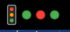
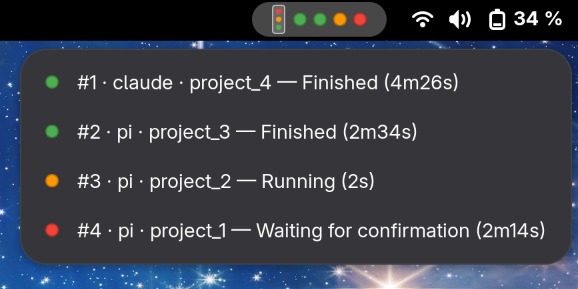

#  Agent Traffic Light

A GNOME Shell indicator that shows one colored dot per AI coding session
(Claude Code, Pi coding agent) in the top bar — so you can tell at a glance
whether each session is idle, working, or waiting on you, across as many
terminals and workspaces as you have open.

- 🟢 **Green** — finished / idle, waiting for a new task
- 🟠 **Orange** — running
- 🔴 **Red** — waiting for your confirmation (a permission prompt, or an
  agent explicitly asking you a question)

Clicking a session in the menu jumps you straight to its window, even on a
different workspace.





## How it works

There's no process-scanning or polling of `ps` — each agent explicitly
reports its own state:

```
gnome-extension/     GNOME Shell extension: renders the dots and the menu,
                      reads ~/.local/state/agent-traffic-light/sessions/*.json
hooks/                Claude Code hook script (Node) that writes that state,
                      packaged as a plugin via .claude-plugin/
pi-extension/         Pi coding agent extension (TypeScript) that does the same,
                      discovered via package.json's "pi" manifest
```

Both integrations write small JSON files to
`~/.local/state/agent-traffic-light/sessions/`, one per session. The GNOME
extension just watches that directory — it doesn't know or care which tool
wrote the file, so adding support for another agent is just a matter of
writing `{ agent, session, label, status, ts, pid }` to that directory
following the same convention (see either integration for the exact shape).

## Requirements

- GNOME Shell 45 or newer (Wayland or X11)
- `gettext` (provides `msgfmt`, used to pack the GNOME extension's
  translations — see [Install](#1-gnome-shell-extension))
- [Node.js](https://nodejs.org/) (used by the Claude Code hook and available
  wherever Pi runs)
- [Claude Code](https://claude.com/claude-code) and/or
  [Pi coding agent](https://github.com/badlogic/pi-mono) — you only need
  whichever one(s) you actually use, the two integrations are independent

## Install

### 1. GNOME Shell extension

```bash
git clone https://github.com/mavenel/agent-traffic-light.git
cd agent-traffic-light
```

Requires `gettext` (provides `msgfmt`, used to bundle translations) — install
it via your distro's package manager if you don't already have it; without it
`pack` fails with an `msgfmt`-related error.

```bash
gnome-extensions pack --force -o /tmp gnome-extension --podir=po --gettext-domain=agent-traffic-light
gnome-extensions install /tmp/agent-traffic-light@mavenel.shell-extension.zip --force
gnome-extensions enable agent-traffic-light@mavenel
```

Then **log out and back in** — GNOME Shell only loads a new extension's code
on session start. `gnome-extensions info agent-traffic-light@mavenel`
should show `State: ACTIVE` once it has.

On NixOS, `nix-build` (using `default.nix`) packages the extension
declaratively instead — add the result to `environment.systemPackages` or
`home.packages`, then `gnome-extensions enable agent-traffic-light@mavenel`
and re-login as above.

### 2. Claude Code

Packaged as a Claude Code plugin — this repo is its own self-hosted
marketplace, so there's no separate hook script to wire up by hand.

```bash
claude plugin marketplace add mavenel/agent-traffic-light
claude plugin install agent-traffic-light@agent-traffic-light
```

This works from inside an interactive `claude` session too, as
`/plugin marketplace add ...` / `/plugin install ...`. No restart needed —
hooks run fresh every time. Check `claude plugin list` afterward for
`Status: ✔ enabled`.

### 3. Pi coding agent

```bash
pi install git:github.com/mavenel/agent-traffic-light
```

Pi clones the repo and discovers the extension automatically via this
repo's `package.json`. If Pi is already running, run `/reload` inside it to
pick up the new extension without restarting.

## Local development

Each of the three pieces has a different edit/reload cycle:

- **`hooks/claude-hook.js`** — no reload needed at all. It's a fresh Node
  process spawned by Claude Code on every hook event, reading the file from
  disk each time. Edit it and your very next tool call / prompt picks up the
  change, even in an already-running `claude` session.

- **`pi-extension/traffic-light.ts`** — hot-reloadable if installed from an
  auto-discovered location (`~/.pi/agent/extensions/` or `.pi/extensions/`,
  see [extensions.md](https://github.com/badlogic/pi-mono) for the pi side of
  this), or during local dev, symlinked there:

  ```bash
  mkdir -p ~/.pi/agent/extensions
  ln -sf "$(pwd)/pi-extension/traffic-light.ts" ~/.pi/agent/extensions/traffic-light.ts
  ```

  After editing, run `/reload` inside a running `pi` session to pick up the
  change without restarting.

- **`gnome-extension/`** — the slow one. GNOME Shell only (re)reads an
  extension's JS from disk the first time it's loaded in a session; neither
  `gnome-extensions disable`/`enable` nor reinstalling the zip forces a
  re-read of changed code. After every edit:

  ```bash
  gnome-extensions pack --force -o /tmp gnome-extension --podir=po --gettext-domain=agent-traffic-light
  gnome-extensions install /tmp/agent-traffic-light@mavenel.shell-extension.zip --force
  ```

  then **log out and back in** (Wayland has no `Alt+F2` → `r` equivalent).
  Advanced/faster option if you're doing several iterations in a row: open
  Looking Glass (`Alt+F2` → `lg`), run
  `global.context.unsafe_mode = true` then `Meta.restart("reload")` — this
  restarts just the Shell process (a couple of seconds, keeps your windows
  open) instead of a full session logout.

  Check `gnome-extensions info agent-traffic-light@mavenel` — `State: ACTIVE`
  means your latest code is loaded; `ERROR` means it crashed (check
  `journalctl -b 0 | grep agent-traffic-light` for the stack trace, GNOME Shell
  logs extension exceptions there).

**Testing the display without a real agent session:** the GNOME extension
only reads `~/.local/state/agent-traffic-light/sessions/*.json` — you can drop
fake session files there directly to see dots appear/change color without
running `claude` or `pi` at all:

```bash
mkdir -p ~/.local/state/agent-traffic-light/sessions
echo '{"agent":"pi","session":"demo","label":"myproject","status":"waiting","ts":'"$(date +%s)"'}' \
  > ~/.local/state/agent-traffic-light/sessions/pi-demo.json
# ... and remove it when done
rm ~/.local/state/agent-traffic-light/sessions/pi-demo.json
```

## Translations

The GNOME extension's on-screen text is translated via gettext, sourced from
`gnome-extension/po/`. It follows your system's language automatically (no
setting to change) and falls back to English for anything untranslated.
Currently available: English (source strings), French (`po/fr.po`).

To add a language: copy `po/agent-traffic-light.pot` to `po/<lang-code>.po`,
translate each `msgstr`, and set the `Language:` header — no code changes or
rebuild step needed beyond the normal packaging commands above.

## Known limitations

- **Clicking a session jumps to its window**, but if you use a
  single-instance terminal app where every window/tab shares one process
  (e.g. GNOME Console), the click has to disambiguate between them. It uses,
  in order: the window that had focus when the session first appeared, then
  Pi's own window title (which natively includes the project directory
  name), then a best-effort fallback. Two sessions running in the exact same
  directory in that kind of terminal can't always be told apart this way.
- The green/orange/red states depend on the specific hook events each tool
  fires; if either Claude Code or Pi changes its hook/event API, the mapping
  in `hooks/claude-hook.js` or `pi-extension/traffic-light.ts` may need
  updating.

## License

MIT © [mavenel](https://github.com/mavenel) — see [LICENSE](LICENSE).
